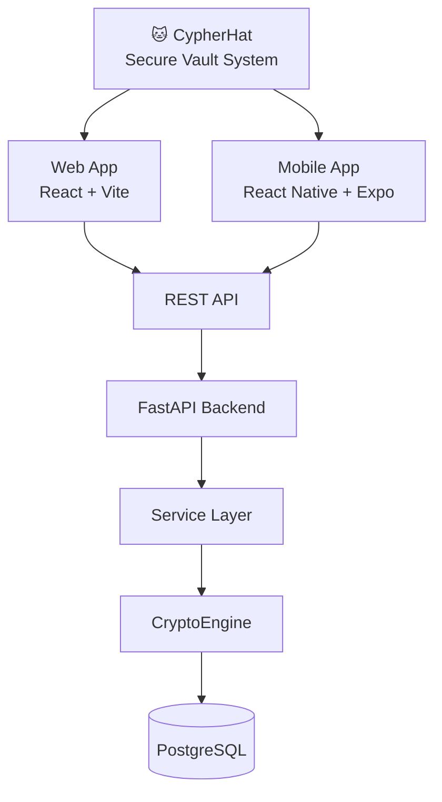
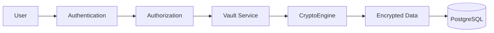
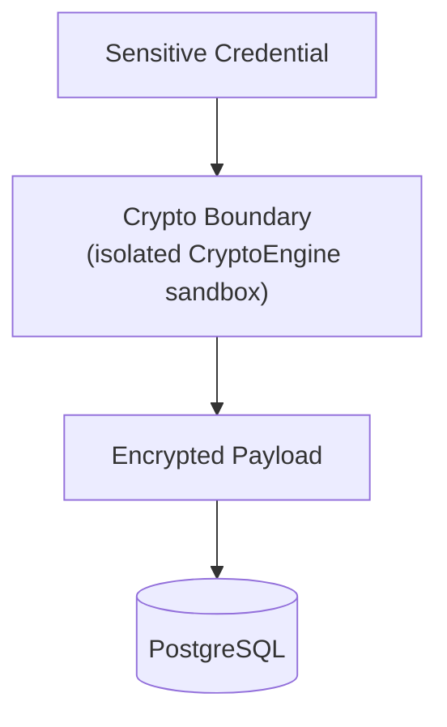
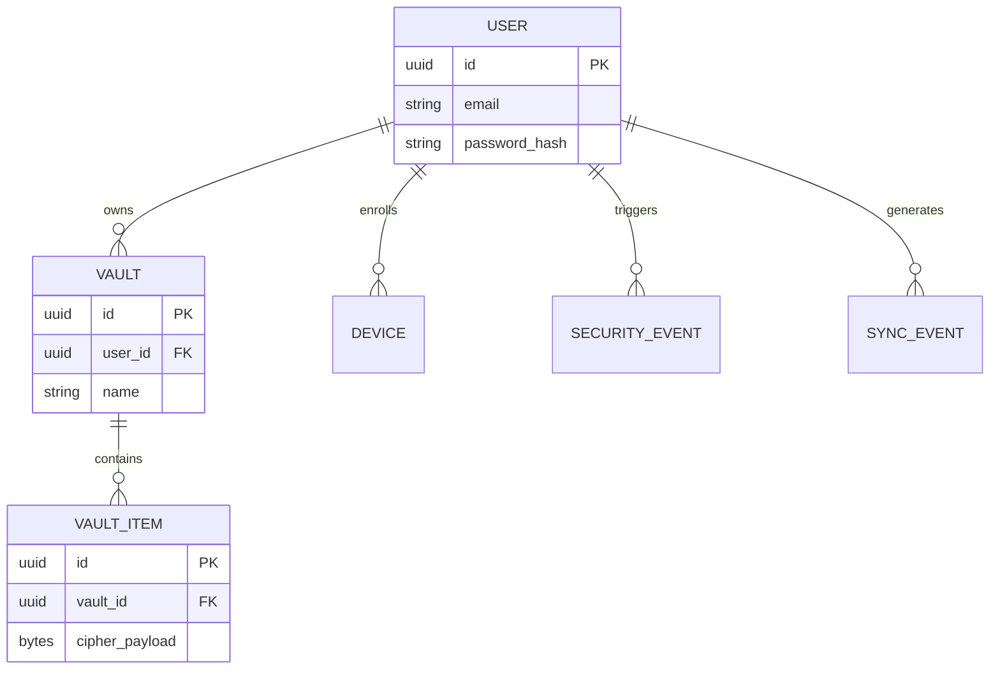
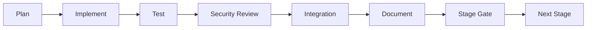

<div align="center">


### Secure Credential & Secrets Vault

*Serious Security × Unserious Cat*

<br/>


</div>

---

## 📖 Table of Contents

1. [Overview](#-overview)
2. [Why CypherHat?](#-why-cypherhat)
3. [Core Features](#-core-features)
4. [Architecture](#-architecture)
5. [Security Architecture](#-security-architecture)
6. [Cryptographic Boundary](#-cryptographic-boundary)
7. [Technology Stack](#-technology-stack)
8. [Database Architecture](#-database-architecture)
9. [Development Roadmap](#-development-roadmap)
10. [Testing & Verification](#-testing--verification)
11. [Project Structure](#-project-structure)
12. [Getting Started](#-getting-started)
13. [Screenshots](#-screenshots)
14. [Documentation](#-documentation)
15. [Future Scope](#-future-scope)
16. [Team](#-team)
17. [Disclaimer](#-disclaimer)

---

## 🐱 Overview

**CypherHat** is a modern, security-focused credential and secrets vault built for clarity, modularity, and strict cryptographic isolation. It provides one unified vault across **Web** and **Mobile**, backed by a centralized modular-monolith API.

CypherHat manages sensitive data such as passwords, API keys, email credentials, recovery codes, and secure notes. Unencrypted secrets never reach persistent storage or unauthenticated boundaries.

---

## 🎯 Why CypherHat?

Conventional CRUD-based credential managers often scatter cryptographic logic across the codebase. That risks accidental logging, loose authorization boundaries, and cryptographic misuse. CypherHat addresses this with:

| Principle | What it means |
| --- | --- |
| 🔒 **Strict User Isolation** | Enforced data segregation prevents cross-tenant vault traversal. |
| 🧱 **Isolated Crypto Boundary** | All cryptographic operations go through a uniform `CryptoEngine` interface. |
| 🚫 **Zero-Plaintext Policy** | Plaintext secrets never touch the database, application logs, or URL parameters. |
| ✅ **Stage-Gated Delivery** | Every stage passes a formal security review and verification gate. |

---

## ✨ Core Features

- **Centralized Vault Management:** passwords, secure notes, API tokens, and credentials in a single dashboard.
- **Multi-Device Support:** one shared backend serving Web, Android, and iOS clients.
- **Cryptographic Sandbox:** a modular cipher interface with hot-swappable, independently testable primitives.
- **Auditable Security Log:** structured tracking of security events, device enrollments, and access authorizations.

---

## 🏗 Architecture

CypherHat uses a shared modular-monolith backend that serves web and mobile clients over a unified REST interface.



---

## 🛡 Security Architecture

Security is designed into the request pipeline rather than bolted on afterward.



**Request lifecycle**


---

## 🔐 Cryptographic Boundary

Sensitive credentials pass through a strict zero-plaintext pipeline before persistence. All cryptographic operations live inside a dedicated `CryptoEngine` sandbox, so cipher logic never spreads through the codebase.



> ❌ **Plaintext never reaches the database or application logs.**

---

## 🧰 Technology Stack

| Layer | Component | Technologies |
| --- | --- | --- |
| **Frontend (Web)** | UI / State | React 18, TypeScript, Vite, Tailwind CSS, TanStack Query, Axios, Lucide React |
| **Frontend (Mobile)** | Cross-Platform | React Native, Expo, TypeScript |
| **Backend API** | Application Server | Python 3.11+, FastAPI, Pydantic v2, SQLAlchemy 2.0, Alembic |
| **Database** | Primary Storage | PostgreSQL 15+ |
| **Security** | Crypto Framework | `cryptography`, Passlib (Argon2 / bcrypt), dedicated `CryptoEngine` sandbox |

---

## 🗄 Database Architecture



---

## 🗺 Development Roadmap

Development follows an incremental, stage-gated model. Each phase is tested and security-reviewed before integration.

| Stage | Focus | Status |
| :---: | --- | :---: |
| 0 | Harness | ⬜ |
| 1 | Repository | ⬜ |
| 2 | Backend | ⬜ |
| 3 | Auth | ⬜ |
| 5 | Vaults | ⬜ |
| 6 | Web | ⬜ |
| 7 | Mobile | ⬜ |
| 8 | Crypto | ⬜ |
| 9 | Devices | ⬜ |
| 10 | Sync | ⬜ |
| 11 | Integrity | ⬜ |

> Update the status column as stages pass their gates (⬜ planned · 🟨 in progress · ✅ done).

---

## 🧪 Testing & Verification

Every stage runs this pipeline before moving on:



---

## 📁 Project Structure

```text
cypherhat/
├── apps/
│   ├── web/                  # React + Vite web client
│   └── mobile/               # React Native + Expo mobile app
├── backend/
│   ├── app/
│   │   ├── api/              # REST endpoints & controllers
│   │   ├── core/             # Configuration & security primitives
│   │   ├── crypto/           # CryptoEngine sandbox & interface
│   │   ├── models/           # SQLAlchemy data models
│   │   ├── schemas/          # Pydantic schemas
│   │   └── services/         # Business logic layer
│   ├── alembic/              # Database migrations
│   └── tests/                # Unit, integration & security tests
├── assets/                   # README images & branding
└── docs/                     # Architecture & stage-gate documentation
```

---

## 🚀 Getting Started

> Commands below are a starting template. Adjust them to match your actual setup.

**Prerequisites:** Python 3.11+, Node.js 18+, PostgreSQL 15+

```bash
# 1. Clone the repository
git clone https://github.com/<your-username>/cypherhat.git
cd cypherhat

# 2. Backend
cd backend
python -m venv .venv && source .venv/bin/activate
pip install -r requirements.txt
cp .env.example .env            # set DB URL and secret keys
alembic upgrade head
uvicorn app.main:app --reload

# 3. Web client (new terminal)
cd apps/web
npm install
npm run dev

# 4. Mobile client (new terminal)
cd apps/mobile
npm install
npx expo start
```

---

## 🖼 Screenshots

*Web dashboard and mobile app previews coming soon.*

---

## 📚 Documentation

- [Architecture Specification](docs/architecture.md)
- [Security & Threat Model](docs/security.md)
- [CryptoEngine Sandbox Guidelines](docs/crypto_sandbox.md)
- [Stage-Gated Pipeline](docs/stage_gates.md)

---

## 🔭 Future Scope

- Zero-knowledge, client-side key derivation (PBKDF2 / Argon2id in the web runtime).
- End-to-end device synchronization over encrypted WebSockets.
- Decentralized integrity-verification layer for tamper-evident audit logs.

---

## 👥 Team

Developed and maintained by the **CypherHat Security Core Team**.

---

## ⚠️ Disclaimer

> **Note:** CypherHat is provided for security research and credential management under the terms of the [MIT License](LICENSE). Configure environment keys and database encryption parameters properly before any production deployment.

<div align="center">

**CypherHat** · *Your secrets. Your vault.* 🐱🎩

</div>
